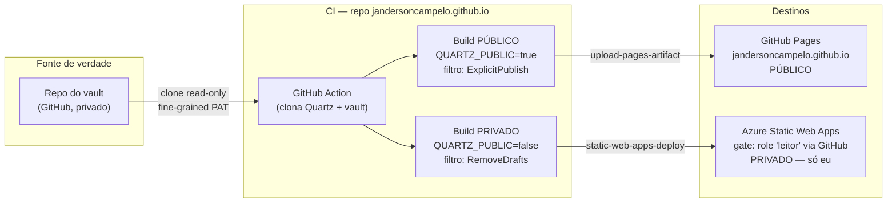

# Spec — Digital Garden (Obsidian → Public + Private)

| | |
| --- | --- |
| **Status** | ⚠️ Parcialmente superseded (ver banner abaixo) |
| **Autor** | Janderson Campelo |
| **Data** | 2026-07-24 |
| **Repo de configuração** | `jandersoncampelo.github.io` |
| **Repo de conteúdo** | `jandersoncampelo/the-vault` (Obsidian, privado, separado) |

---

> ## ⚠️ Atualização — o que mudou desde o design original
>
> Este spec descreve uma arquitetura de **dois destinos** (público no GitHub Pages + vault completo privado no Azure SWA). A implementação **divergiu** e o **destino privado foi abandonado**:
>
> - **Só há um destino: GitHub Pages (público, opt-in `publish: true`).** O SWA foi removido.
> - **Motivo:** o build completo do vault no Quartz v5 deu **728 MB**, acima do limite **hard de 250 MB** do Azure SWA Free; o objetivo de "acesso privado ao vault inteiro" (RF1/objetivo 1) foi **dropado**.
> - **Gerador atualizado para Quartz v5** (config em YAML `quartz.config.yaml`, plugins como pacotes npm). O `quartz.config.ts`, o `staticwebapp.config.json` e o `quartz.config.public.yaml` foram removidos.
> - **Vazamento descoberto e corrigido:** o Quartz copia arquivos não-`.md` como assets sem passar pelo filtro `publish` (era um vazamento ativo). Mitigado por `ignorePatterns` + `canvas-page`/`bases-page` desligados.
>
> **O que continua válido abaixo:** o princípio de **publicação opt-in default-deny** (§7 Controle 1), o **repo de config sem conteúdo** (AD-5), o **Quartz como gerador** (AD-6, agora v5), e o **risco residual de vazamento por wikilink** (§7). **O que NÃO vale mais:** tudo sobre o destino privado/SWA/Entra/role (§4 build privado, §7 Controle 2, AD-1, AD-2, AD-4, os critérios de aceitação do SWA). Para o estado atual, ver `CLAUDE.md` e `README.md`.

## 1. Contexto e problema

Mantenho uma base de conhecimento pessoal em Obsidian (markdown) que mistura anotações pessoais, material técnico e conteúdo relacionado ao trabalho. Quero **duas capacidades distintas** a partir dessa mesma base:

1. **Acesso remoto privado ao vault inteiro** — poder ler tudo de qualquer lugar, com autenticação, sem que ninguém além de mim tenha acesso.
2. **Publicar seletivamente alguns artigos** — uma vitrine pública para compartilhar notas específicas, como um blog.

A restrição estrutural que molda toda a solução: **GitHub Pages de usuário (`*.github.io`) é sempre público** — não há tier gratuito que o torne privado. Portanto o mesmo endpoint não pode servir o vault completo atrás de login. Isso força uma arquitetura de **dois destinos**, cada um com sua própria política de exposição.

## 2. Objetivos e não-objetivos

**Objetivos**

- Servir o vault completo de forma privada, autenticada, somente leitura, acessível a exatamente um usuário (eu).
- Publicar um subconjunto opt-in do vault num site público navegável.
- Custo recorrente de **R$ 0** (free tiers).
- Nenhuma nota versionada no repo de configuração público.
- Automação completa: editar no Obsidian → publicar sem passos manuais.

**Não-objetivos**

- Edição via web (é read-only por construção; a escrita continua no Obsidian).
- Colaboração multiusuário ou papéis além de "eu".
- SLA de produção (free tier não tem SLA; uso pessoal).
- Comentários, autenticação de leitores no site público, ou paywall.
- Sincronização em tempo real (latência de minutos é aceitável).

## 3. Requisitos

**Funcionais**

- RF1: O site privado exige autenticação e nega acesso a qualquer identidade que não seja a minha.
- RF2: O site público expõe **apenas** notas explicitamente marcadas para publicação.
- RF3: Uma nota marcada como rascunho não aparece em nenhum dos dois destinos.
- RF4: Uma única execução de pipeline atualiza ambos os destinos.
- RF5: O conteúdo é sempre obtido da fonte de verdade (o repo do vault) no momento do build.

**Não-funcionais**

- RNF1 (segurança): a exposição pública é *default-deny* — o estado padrão de uma nota é privado.
- RNF2 (segurança): o repo de configuração pode ser público sem vazar conteúdo.
- RNF3 (custo): tudo dentro de free tiers permanentes.
- RNF4 (operação): rebuild automático em cadência fixa, com opção de disparo imediato.
- RNF5 (reprodutibilidade): a versão do gerador de site é fixável.

## 4. Arquitetura

Três repositórios/serviços, com o conteúdo fluindo da fonte única para dois destinos:

**Princípio central:** o repo de configuração (`jandersoncampelo.github.io`) contém *apenas* configuração — `quartz.config.ts`, o workflow, `staticwebapp.config.json`. Nenhuma nota. O conteúdo é clonado do vault em tempo de build, vive só no runner efêmero e é descartado ao fim da execução. Por isso o repo de configuração pode ser público sem risco.

O mesmo gerador (Quartz) roda **duas vezes** na mesma execução, com filtros diferentes selecionados por variável de ambiente. Cada build produz um diretório distinto que vai para seu respectivo destino.

## 5. Componentes

- **Gerador de site — Quartz v4.** Compila o markdown do Obsidian em HTML estático, resolvendo wikilinks, backlinks, grafo e busca. Escolhido por ser nativamente orientado ao Obsidian.
- **Repo de configuração — `jandersoncampelo.github.io`.** Guarda config + automação. Público, sem conteúdo.
- **Repo do vault.** Fonte de verdade do conteúdo. Privado. Clonado read-only pelo pipeline.
- **GitHub Actions.** Orquestra clone, build duplo e ambos os deploys numa job só.
- **GitHub Pages.** Hospeda o subconjunto público.
- **Azure Static Web Apps (Free).** Hospeda o vault completo, com autenticação Entra embutida e autorização por rota.

## 6. Fluxo de build e deploy

1. Gatilho (cron, push no repo de config, ou disparo manual).
2. Checkout do repo de configuração.
3. Clone do Quartz na ref fixada.
4. Cópia do `quartz.config.ts` customizado sobre o Quartz.
5. Clone do vault (via fine-grained PAT) para `content/`; remoção do `.git` do vault.
6. `npm ci`.
7. Build público (`QUARTZ_PUBLIC=true`) → `dist-public/`.
8. Build privado (`QUARTZ_PUBLIC=false`) → `dist-private/`; injeção do `staticwebapp.config.json`.
9. Deploy `dist-public/` → GitHub Pages.
10. Deploy `dist-private/` → Azure SWA.

## 7. Modelo de segurança

A separação público/privado é aplicada por **dois controles independentes**, um em cada destino, de modo que a falha de um não expõe o vault inteiro.

**Controle 1 — Filtro de publicação (destino público).** O build público usa o filtro `ExplicitPublish` do Quartz, que descarta qualquer nota sem `publish: true` no frontmatter. A política é *default-deny*: o estado padrão de uma nota é não-publicada. Isso é deliberadamente mais seguro que uma seleção por pasta (*default-allow*), onde uma nota privada vaza ao ser movida para o lugar errado.

**Controle 2 — Gate de autorização (destino privado).** O `staticwebapp.config.json` restringe todas as rotas à role custom **`leitor`**. O Azure SWA intercepta toda requisição, redireciona para o login (`/.auth/login/github`) e só libera quem possui essa role. A role é concedida por convite manual a exatamente uma conta (a minha).

> **Implementação:** o provider adotado foi **GitHub** (e não o Entra originalmente cogitado) e a role foi nomeada **`leitor`**. O princípio de design é idêntico; só mudou o nome do provider e da role. Dois requisitos de consistência: (a) o nome da role no `allowedRoles` precisa bater exatamente com o do convite; (b) o login precisa usar o mesmo provider em que a role foi concedida — logar por outro provider gera sessão sem a role e resulta em 403.

> ⚠️ **Armadilha crítica:** a role embutida `authenticated` do SWA aceita *qualquer* conta válida do provider — não apenas a minha. Usar `authenticated` transformaria "só eu" em "qualquer pessoa com conta GitHub". O gate **precisa** usar uma role custom (`leitor`) com concessão explícita por convite.

**Risco residual — vazamento por wikilink.** O `ExplicitPublish` remove os nós não-publicados do grafo, mas se uma nota **pública** contém um link `[[Nota Privada]]`, o *texto* desse link permanece no HTML público, revelando o nome (não o conteúdo) da nota interna. Mitigação: revisão manual do build público na primeira publicação e sempre que se publicar uma nota nova; uso de `ignorePatterns` para excluir pastas sensíveis inteiras.

**Manejo de segredos.**

- O acesso ao vault usa um **fine-grained PAT** com escopo mínimo: apenas `Contents: Read-only`, apenas no repo do vault. Sem escopo de escrita, sem acesso a outros repos.
- O `GITHUB_TOKEN` automático não é usado para o clone do vault (não alcança repositórios de terceiros/separados).
- O deployment token do SWA e o PAT ficam como *encrypted secrets* do repo de configuração, nunca em texto.

## 8. Configuração e segredos

**Ajustes no `env:` do workflow**

- `VAULT_REPO` — `owner/repo` do vault.
- `SWA_HOSTNAME` — hostname default do Static Web App.
- `QUARTZ_REF` — branch/commit do Quartz a fixar.

**Secrets do repo de configuração**

| Secret | Uso | Escopo |
| --- | --- | --- |
| `VAULT_REPO_PAT` | clonar o vault | fine-grained, `Contents: Read`, só o repo do vault |
| `AZURE_SWA_TOKEN` | deploy no SWA | deployment token do recurso SWA |

**Settings**

- GitHub Pages → Source: **GitHub Actions**.
- Azure SWA → Role management → convidar minha conta **GitHub** com a role **`leitor`** (após o primeiro deploy).

## 9. Operação

**Gatilhos.** `schedule` (cron a cada 6h), `push` no repo de configuração (mudanças de layout/config), e `workflow_dispatch` (manual). Como o vault mora em outro repo, um `push` de nota **não** dispara o pipeline — daí o cron. Upgrade opcional: uma workflow no repo do vault que chame `repository_dispatch` para rebuild imediato.

**Concorrência.** Grupo único com `cancel-in-progress` para evitar deploys sobrepostos.

**Modos de falha e comportamento esperado**

- PAT expirado/revogado → clone do vault falha → pipeline aborta; **nenhum** dos destinos é atualizado (não há publicação parcial de estado antigo).
- Deploy do Pages falha → SWA pode ainda não ter rodado; reexecutar o pipeline é idempotente.
- Config restritiva no ar antes do convite de role → o próprio dono fica bloqueado até aceitar o convite (por isso o convite é o passo seguinte ao primeiro deploy).
- Quartz `v4` upstream quebra o build → fixar `QUARTZ_REF` num commit conhecido.

## 10. Decisões arquiteturais

**AD-1 — Azure SWA como destino privado (vs. Oracle OCI, Google Cloud).**
Decisão: Azure SWA Free. Motivo: é o único dos três com autenticação gratuita e turnkey na frente de site estático, com autorização por rota — sem VM, sem load balancer, sem auth proxy manual. Alternativas: Oracle Always Free (VM + reverse proxy + auth manual — mais flexível, muito mais operação) e GCP (IAP na frente de Cloud Run exige HTTPS LB pago; App Engine + IAP cabe no free mas é mais fiddly). Fator adicional: já opero no ecossistema Azure/Entra.

**AD-2 — Arquitetura de dois destinos (vs. destino único).**
Decisão: GitHub Pages (público) + Azure SWA (privado). Motivo: Pages de usuário é imutavelmente público no tier gratuito, logo não pode hospedar o vault privado; em vez de descartá-lo, ele vira a vitrine pública que eu queria de qualquer forma.

**AD-3 — Publicação opt-in por frontmatter (vs. seleção por pasta).**
Decisão: `publish: true` via `ExplicitPublish`. Motivo: *default-deny*. Numa base que mistura conteúdo pessoal e de trabalho, o padrão precisa ser "não publica", com a exposição sendo um ato explícito.

**AD-4 — Role custom `leitor` (vs. role embutida `authenticated`).**
Decisão: role custom com convite explícito. Motivo: `authenticated` admite qualquer conta federada; só uma role custom concedida por convite realiza o requisito de usuário único. (Implementada como `leitor` via provider GitHub; o nome original cogitado era `reader` via Entra.)

**AD-5 — Repo de configuração sem conteúdo (vs. vault commitado no site).**
Decisão: conteúdo clonado em build time, nunca versionado no repo de config. Motivo: permite que o repo de configuração seja público sem vazar nada, e mantém uma única fonte de verdade (o vault).

**AD-6 — Quartz como gerador (vs. MkDocs, Hugo, etc.).**
Decisão: Quartz v4. Motivo: suporte nativo a wikilinks, backlinks, grafo e busca do Obsidian, com o menor atrito de conversão.

## 11. Restrições e premissas

- GitHub Pages de usuário é sempre público (free).
- Azure SWA Free suporta convite de role custom; provider OIDC custom e atribuição via Graph exigem Standard (não necessários aqui).
- Regiões do SWA são limitadas; `eastus2` é a referência de latência para o Brasil.
- O vault é um repo Git (premissa de que já está, ou será colocado, sob versionamento no GitHub).

## 12. Critérios de aceitação

- [ ] Acessar o hostname do SWA sem login redireciona ao Entra.
- [ ] Após login com minha conta, o vault completo é navegável.
- [ ] Login com uma conta Microsoft diferente (sem a role) é negado.
- [ ] `jandersoncampelo.github.io` carrega sem qualquer login.
- [ ] Uma nota sem `publish: true` **não** aparece no site público (conteúdo, grafo e busca).
- [ ] Uma nota com `draft: true` não aparece em nenhum dos destinos.
- [ ] O repo de configuração público não contém nenhuma nota do vault.
- [ ] Um commit no vault reflete em ambos os destinos dentro de uma janela de cron.
- [ ] Custo mensal observado = R$ 0.

## 13. Trabalho futuro

- Ponte `repository_dispatch` para rebuild imediato ao commitar no vault.
- Fixar `QUARTZ_REF` num commit específico após validar um build estável.
- Domínio custom (ex.: subdomínio próprio) sobre um ou ambos os destinos.
- Verificação automatizada anti-vazamento: um passo de CI que falha o build público se detectar wikilinks apontando para notas fora do subconjunto publicado (fecharia o risco residual do §7 sem depender de revisão manual).
- Analytics no site público (Plausible/umami self-hosted).